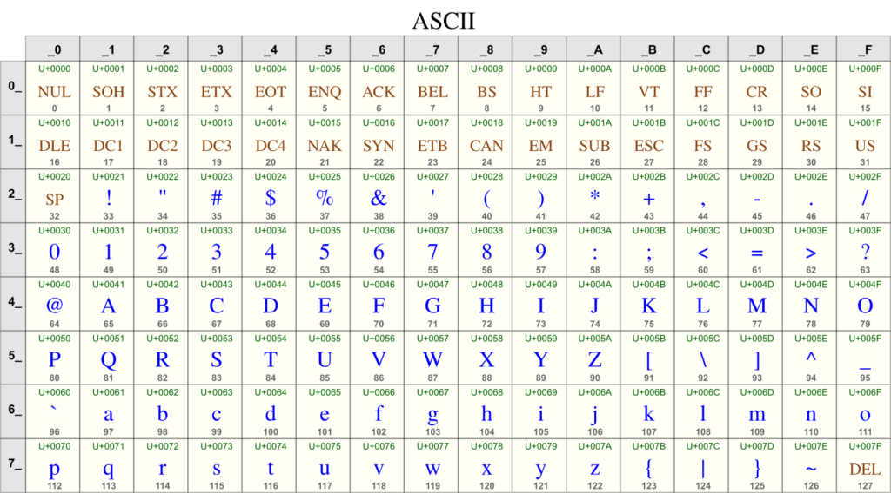
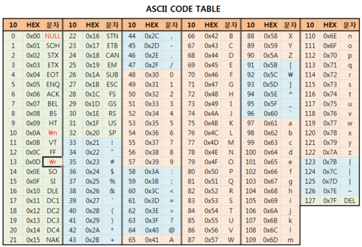

문자 인코딩
==
## 문자 인코딩
컴퓨터는 10진수를 2진수로 변경해서 메모리에 저장한다.

하지만 문자를 숫자로 변경할 수는 없다. 

이런 문제를 해결하기 위해 문자 집합을 만들어 냈다.

그림과 같이 문자와 숫자를 1:1로 연결 시킨 **문자 집합**을 만들고 숫자에 매칭되는 문자를 출력한다.
- **문자 인코딩:** 문자 집합을 통해 문자를 숫자로 변환하는 것
- **문자 디코딩:** 문자 집합을 통해 숫자를 문자로 변환하는 것

### ASCII 문자 집합
컴퓨터 회사 마다 독자적인 문자 집합을 사용하면 서로 다른 컴퓨터 간에 문자가 올바르게 표시되지 않는 문제가 발생할 수 있다.

이런 호환성 문제를 해결하기 위해 ASCII(American Standard Code for Information
Interchange)라는 표준 문자 집합이 1960년도에 개발되었다.

- 7비트를 사용한 문자 집합이다.
- 영어 기호만 표시가 가능했기 때문에 전 세계사람들이 사용하기에는 부족하다.

### ISO_8859_1
- 기존 ASCII 문자 집합에 서유럽 문자를 추가했다.
- 국제 표준화 기구에서 새로운 문자 규격.
- 기존 ASCII 문자 집합과 호환 가능

### EUC-KR
- 초창기에 등장한 한글 문자 집합
- 모든 한글을 담는 것보다는 자주 사용하는 한글 2350개만 포함해서 만듬.
- 한글의 글자는 굉장히 많아 1byte로 표현하는 것이 불가능.
- 2byte를 사용함.

### MS949
- 마이크로소프트가 EUC-KR을 확장해서 만든 인코딩
- 드물고 사용하는 음절을 표현하지 못하는 문제를 해결.

### 전세계 문자 집합
컴퓨터 인구가 늘어나면서, 전세계 문자를 대부분 다 표현할 수 있는 문자집합이 필요하다.
#### 문제점
- 한글 문자표가 설치되지 않은 다른 나라 사람들은 한글로 작성된 문서를 열어볼 수 없다.
- 한 문서안에 영어, 한글, 중국어, 일본어 등 다양한 언어를 함께 저장해야할 경우 문제가 발생한다.
- 다양한 문자 인코딩 표준이 많아 호환성 문제가 많았다.

### 유니코드
- 이를 해결하기 위해 전 세계의 모든 문자들을 단일 문자 세트로 표현할 수 있는 유티코드 표준이 도입됨.
- 하나의 문자 세트에 전 세계 대부분의 언어를 넣어만든 문자 집합.

#### UTF-16
- 2 byte 기반 
- 자주 사용하는 기본 다국어들은 2byte로 표현
- 4byte 표현으로 이모지, 고대 문자 등을 표현
- **단점: ASCII 영문도 2byte를 사용, ASCII와 호환되지 않음.**
  - 영문의 경우 메모리를 2배 더 사용한다.

#### UTF-8
- 1byte 기반, 가변길이 인코딩.
- 1byte ~ 4byte를 사용해서 문자를 인코딩.
  - 1byte: ASCII
  - 2byte: 그리스어, 히브리어
  - 3byte: 한글, 한자, 일본어
  - 4byte: 이모지, 고대문자 등
- 장점: ASCII 문자는 1바이트로 표현할 수 있다.
- 단점: 상대적으로 사용이 복잡함.
- 단점: ASCII를 제외한 일부 언어에서 더 많은 용량을 사용.
- **사실상 표준 인코딩 기술.**

### 정리
#### UTF-8이 사실상 표준 인코딩 인코딩 기술이 된 이유.
- **저장 공간 절약과 네트워크 효율성:** UTF-16은 최소 2바이트를 사용하므로 ASCII 문자로 이루어진 영문 텍스트에서는 UTF-8이 2배 더 효율적이다.
- **ASCII와 호환성:** UTF-8은 ASCII와 호환된다.

## 인코딩, 디코딩
- 영문 인코딩
  - UTF-16과 ASCII는 호환되지 않는다.
  - 영문은 보통 ASCII를 사용한다. UTF-16을 제외한 대부분의 문자 집합에 호환된다.
- 한글 인코딩
  - ASCII, ISO-8859-1로 인코딩 불가.
  - EUC-KR, MS949, UTF-8, UTF-16은 모두 인코딩, 디코딩이 잘된다.
- 서로 다른 문자 집합으로 인코딩 디코딩은 수행하지 말자.

### 정리
- **사실상 표준인 UTF-8을 사용하자.**
- 한글이 깨지는 가장 큰 이유는 다음과 같다.
  - EUC-KR(MS949), UTF-8이 서로 호환되지 않는다.
  - EUC-KR(MS949) 또는 UTF-8로 인코딩한 한글을 ISO-88959-1 디코딩할 때