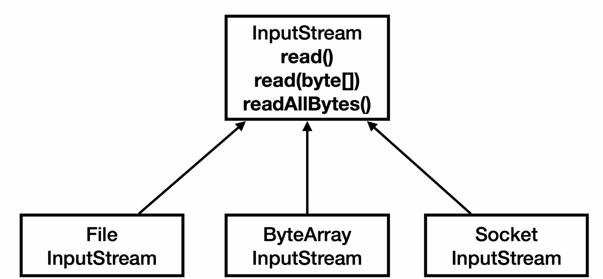
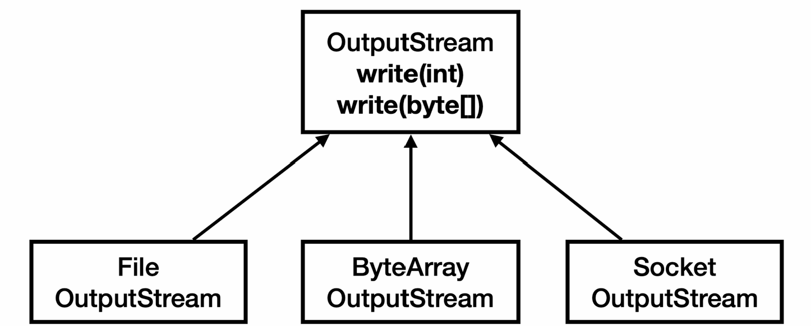

I/O 기본
==
## 스트림
자바 프로세스가 가지고 외부 저장소와 데이터를 주고 받기 위해 **스트림**을 사용해야한다.

스트림은 단방향으로 입력을 위한 입력 스트림, 출력을 위한 출력 스트림 2개가 존재한다.

```java
public class StreamStartMain1 {

    public static void main(String[] args) throws IOException {
        FileOutputStream fos = new FileOutputStream("temp/hello.dat");
        fos.write(65);
        fos.write(66);
        fos.write(67);
        fos.close();

        FileInputStream fis = new FileInputStream("temp/hello.dat");

        int data;
        while((data = fis.read()) != -1) {
            System.out.println(data);
        }
        fis.close();

    }

}
```
- **FileOutputStream**
  - 인자로 전달한 파일이 없다면 생성한다. 
  - 자바 프로세스에서 생성한 데이터를 외부 파일로 내보내고 싶을 때 사용한다.
  - write() 메서드를 통해 byte를 전달하면 내용이 작성된다.
- **FileInputStream**
  - 외부 파일 내용을 자바 프로세스에서 사용하기 위해 사용하는 입력 스트림.
  - read() 메서드를 사용해서 바이트를 하나씩 읽어들인다. 
  - EOF일 경우, -1을 반환한다. 
- 자바 외부 자원을 사용할 때는 반드시 close() 호출해야한다.

### 부분으로 나누어 읽기 vs 전체 읽기

```java
public class StreamStartMain4 {
    public static void main(String[] args) throws IOException {
        FileOutputStream fos = new FileOutputStream("temp/hello.dat");
        byte[] input = {65, 66, 67, 65, 65, 65, 65, 65, 65, 65};
        fos.write(input);
        fos.close();

        FileInputStream fis = new FileInputStream("temp/hello.dat");
        byte[] readBytes = fis.readAllBytes();
        System.out.println(Arrays.toString(readBytes));
        fis.close();
    }
}
```
- read(byte[], offset, length)
  - 스트림의 내용을 부분적으로 읽거나, 읽은 내용을 처리하면서 스트림을 읽어야 할 경우에 적합하다.
  - 메모리 사용량을 제어할 수 있다.
- readAllBytes()
  - 한 번의 호출로 모든 데이터를 읽을 수 있어 편리.
  - 메모리 사용량을 제어할 수 없다.
  - 큰 파일의 경우 OutOfMemoryError가 발생할 수 있다.

## InputStream, OutputStream


- 현대의 컴퓨터는 대부분 byte 데이터를 주고 받는다.
- 데이터를 주고 받는 것을 **I/O**라 한다.
- 자바 내부에 있는 데이터를 외부에 있는 파일에 저장하거나, 네트워크를 콩해 전송하거나 콘솔에 출력할 때 모두 byte 단위로 데이터를 주고 받는다.
- 파일, 네트워크, 콘솔에 입, 출력을 추상화한 InputStream, OutputStream 추상 클래스를 제공한다.

#### 정리
- InputStream, OutputStream이 다양한 스트림을 추상화하고 기본 기능에 대한 표준을 잡아둔 덕분에 편리하게 입출력 작업을 수행할 수 있다.
- 추상화의 장점은 다음과 같다.
  - **일관성:** 모든 종류의 입출력 작업에 대해 동일한 인터페이스를 사용할 수 있어, 코드의 일관성이 유지된다.
  - **유연성:** 실제 데이터 소스나 목적지가 무엇인지에 관계없이 동일한 방식으로 코드를 작성할 수 있다.
  - **확장성:** 새로운 유형의 입출력 스트림을 쉽게 추가할 수 있다. 
  - **재사용성:** 다양한 스트림 클래스들을 조합하여 복잡한 입출력 작업을 수행할 수 있다.
  - **예외 처리:** 표준화된 예외 처리 매커님즈을 통해 일관된 방식으로 오류를 처리할 수 있다.

## 파일 입출력, 성능 최적화
```java
public class CreateFileV1 {
    public static void main(String[] args) throws IOException {
        FileOutputStream fos = new FileOutputStream(FILE_NAME);

        long startTime = System.currentTimeMillis();
        for (int i = 0; i < FILE_SIZE; i++) {
            fos.write(i);
        }


        long endTime = System.currentTimeMillis();
        System.out.println("File created: " + FILE_NAME);
        System.out.println("File size: " + FILE_SIZE / 1024 / 1024 + "MB");
        System.out.println("Time taken: " + (endTime - startTime) + "ms");
        fos.close();
    }
}

public class ReadFileV1 {
  public static void main(String[] args) throws IOException {
    FileInputStream fis = new FileInputStream(FILE_NAME);

    long startTime = System.currentTimeMillis();
    int fileSize = 0;
    int data;
    while ((data = fis.read()) != -1) {
      fileSize += 1;
    }
    fis.close();

    long endTime = System.currentTimeMillis();
    System.out.println("File created: " + FILE_NAME);
    System.out.println("File size: " + fileSize / 1024 / 1024 + "MB");
    System.out.println("Time taken: " + (endTime - startTime) + "ms");
    fis.close();
  }
}
```
- 파일 입출력을 수행하는데 1byte씩 쓰고 읽는 코드이다.
- **시스템 콜**이 read, write를 호출하는 만큼 발생한다. 
- 따라서 굉장히 많은 시간이 걸린다.
- 이런 문제를 해결하기 위해서는 저장할 데이터를 쌓아놓은 다음 저장하면 된다.

### 버퍼 활용
1byte씩 데이터를 전달하는 것이 아닌 배열에 담아놓고 한 번에 여러 byte를 전달하면 시스템 콜을 많이 호출하는 문제를 해결할 수 있다.
```java
// 쓰기
public class CreateFileV2 {
    public static void main(String[] args) throws IOException {
        FileOutputStream fos = new FileOutputStream(FILE_NAME);

        long startTime = System.currentTimeMillis();

        byte[] buffer = new byte[BUFFER_SIZE];
        int bufferIndex = 0;

        for (int i = 0; i < FILE_SIZE; i++) {
            buffer[bufferIndex++] = 1;

            // 버퍼가 가득차면 쓰고, 버퍼를 비운다.
            if (bufferIndex == BUFFER_SIZE) {
                fos.write(buffer);
                bufferIndex = 0;
            }

        }

        // 끝 부분에 오면 버퍼가 가득차지 않고, 남아 있을 수 있다.
        if (bufferIndex > 0) {
            fos.write(buffer, 0, bufferIndex);
        }


        long endTime = System.currentTimeMillis();
        System.out.println("File created: " + FILE_NAME);
        System.out.println("File size: " + FILE_SIZE / 1024 / 1024 + "MB");
        System.out.println("Time taken: " + (endTime - startTime) + "ms");
        fos.close();
    }
}

// 읽기
public class ReadFileV2 {
  public static void main(String[] args) throws IOException {
    FileInputStream fis = new FileInputStream(FILE_NAME);

    long startTime = System.currentTimeMillis();
    byte[] buffer = new byte[BUFFER_SIZE];
    int fileSize = 0;
    int size;
    while ((size = fis.read(buffer)) != -1) {
      fileSize += size;
    }
    fis.close();

    long endTime = System.currentTimeMillis();
    System.out.println("File created: " + FILE_NAME);
    System.out.println("File size: " + fileSize / 1024 / 1024 + "MB");
    System.out.println("Time taken: " + (endTime - startTime) + "ms");
    fis.close();
  }
}
```
**쓰기일 경우**
- 데이터를 모아서 전달하는 역할을 수행하는 용도로 사용하는 것을 **버퍼**라고한다.
- 10byte를 한번에 모아서 전달하면 성능을 최적화할 수 있다.
  - 버퍼의 크기는 4KB, 8KB가 적절하다.
    - 파일 시스템에서 파일을 읽는 기본 단위가 4, 8KB이기 떄문이다.

**읽기의 경우**
- 읽기의 경우에도 버퍼를 전달해서 빠른 시간안에 모든 데이터를 읽어들일 수 있다.

### BufferedOutputStream, InputStream
이렇게 버퍼를 사용하면 읽기, 쓰기 속도를 향상시킬 수 있다.

Java에서는 BufferedOutputStream, BufferedInputStream을 제공한다.

```java
public class CreateFileV3 {
    public static void main(String[] args) throws IOException {
        FileOutputStream fos = new FileOutputStream(FILE_NAME);
        BufferedOutputStream bos = new BufferedOutputStream(fos, BUFFER_SIZE);
        long startTime = System.currentTimeMillis();

        for (int i = 0; i < FILE_SIZE; i++) {
            bos.write(1);
        }
        bos.close();

        long endTime = System.currentTimeMillis();
        System.out.println("File created: " + FILE_NAME);
        System.out.println("File size: " + FILE_SIZE / 1024 / 1024 + "MB");
        System.out.println("Time taken: " + (endTime - startTime) + "ms");
    }
}
```
- BufferedOutputStream은 내부적으로 byte[] buf를 가지고 있다.
- write()를 호출할 경우, 버퍼가 꽉찰 때까지 실제 FileOutputStream의 write()를 호출하지 않고 버퍼에 저장한다.
- 버퍼가 꽉찰 경우에 버퍼에 있는 모든 내용을 시스템 콜을 통해 OS로 전달한다.
- 버퍼가 꽉 차지 않아도 실제 파일에 반영시키고 싶을 경우 flush()를 호출하면 된다.
- close()를 호출하면 버퍼에 저장되어있던 내용을 전부 파일에 반영시키고 내부 스트림까지 close()를 호출한다.
- 이렇게 단독으로 사용할 수는 없지만 제공 받은 스트림에 버퍼와 같은 보조 기능을 제공하는 스트림을 **보조 스트림**이라고 한다.

#### 정리
- 파일의 크기가 크지 않아서, 메모리 사용에 큰 영향을 주지 않는다면 한 번에 처리하자.
- 성능이 중요하고 큰 파일을 나누어 처리해야하면 버퍼를 직접 다루자.
- 성능이 중요하지 않고, 버퍼 기능이 필요하면 BufferedXX를 사용하자.
  - 동기화 코드가 있어 스레드 안전하지만 그로 인한 성능저하가 있다.

### 스트림에서 문자 다루기

